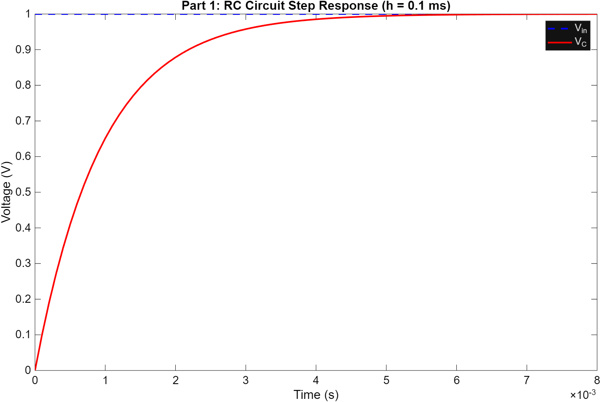
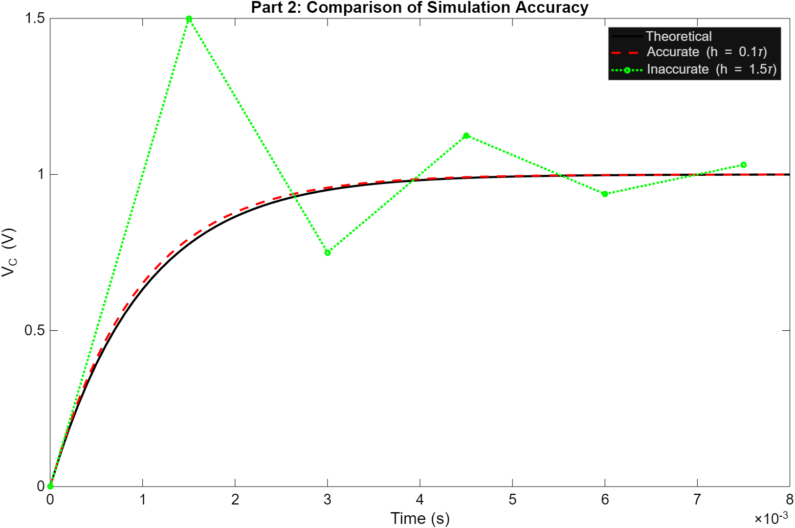
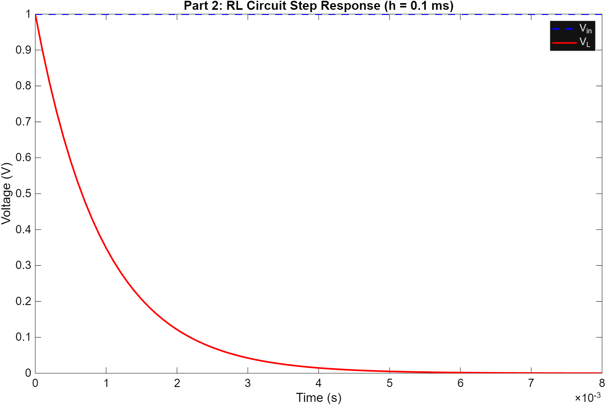
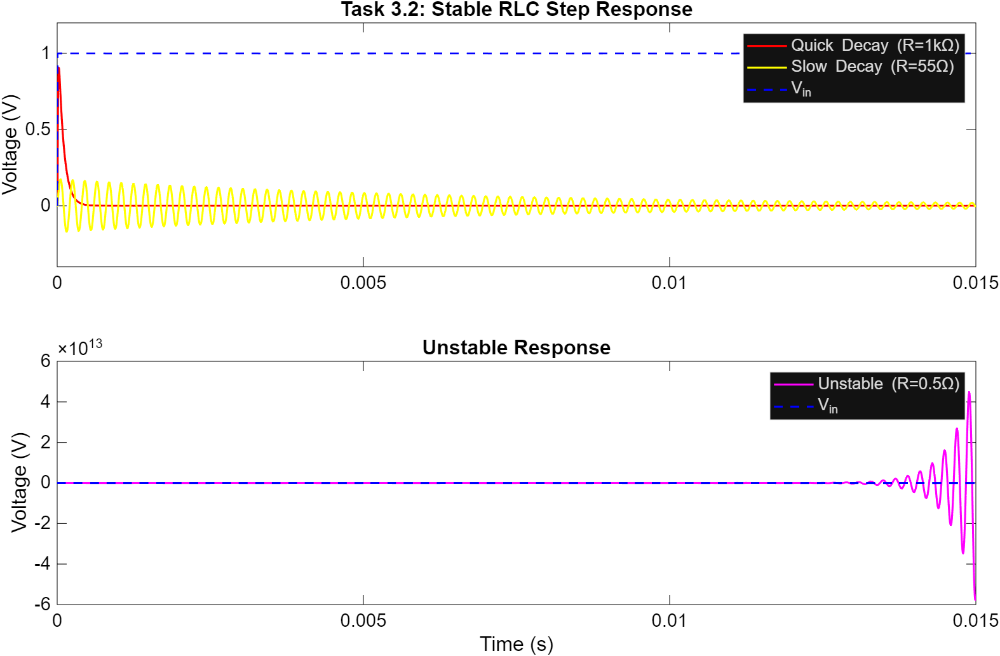
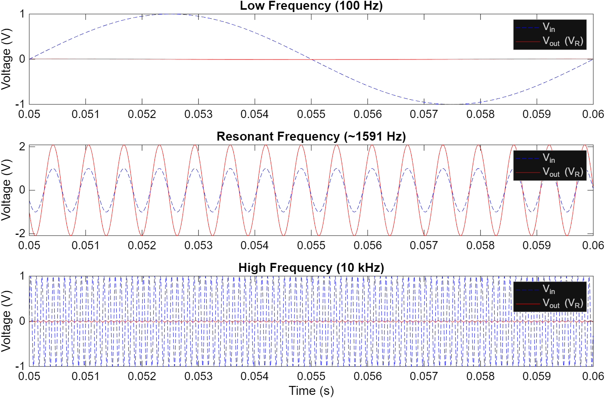
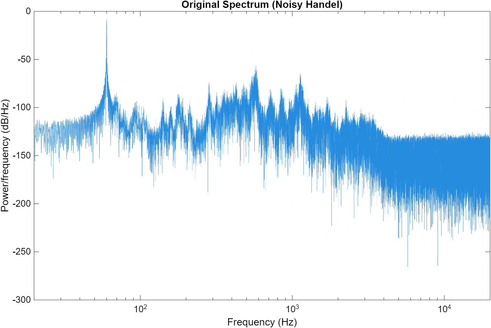
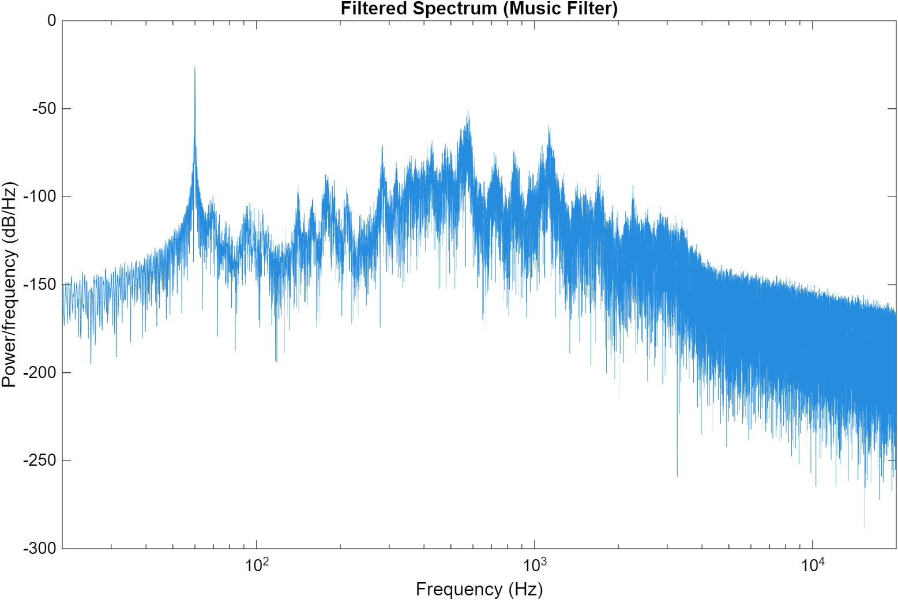
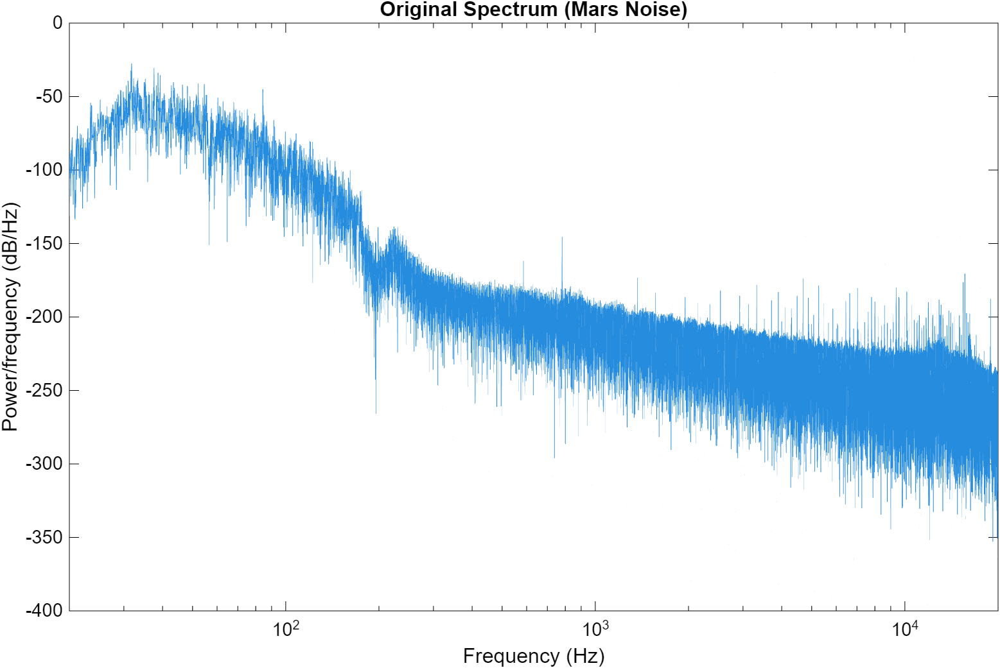
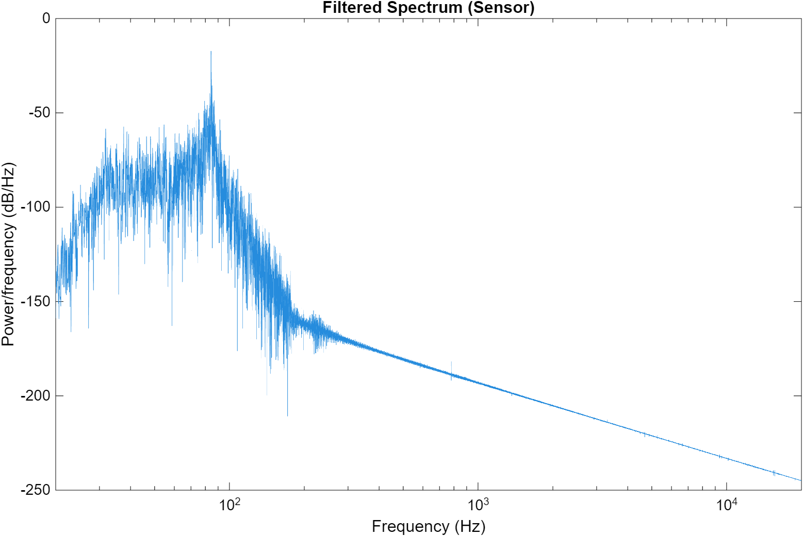
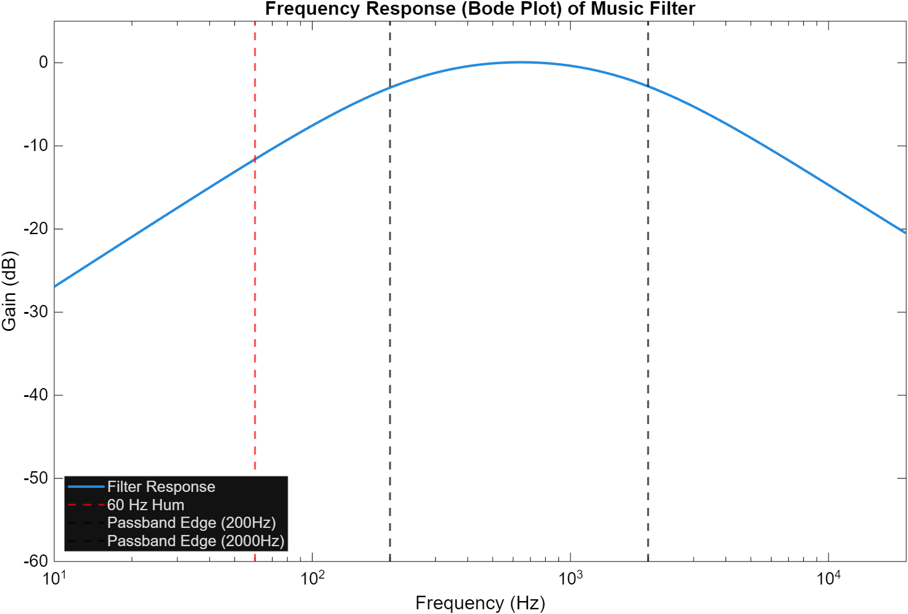

# ESE 105 — Case Study 2: RLC Circuits as Resonators, Sensors, and Filters

**Washington University in St. Louis | ESE 105**  
**Authors: Derek Nester & Riley Panaligan**

> 📄 See the full write-up: [`CASE_STUDY_2.pdf`](CASE_STUDY_2.pdf)

This case study models RLC circuits as signal processing systems using discrete-time state-space simulation. Starting from first principles (RC and RL circuits), the project builds up to full RLC bandpass filters applied to real audio signals — a noisy music recording and a Mars helicopter sound clip.

---

## Table of Contents

- [Background](#background)
- [Project Structure](#project-structure)
- [Part 1 — RC Circuit](#part-1--rc-circuit)
- [Part 2 — RL Circuit](#part-2--rl-circuit)
- [Part 3 — Full RLC Circuit](#part-3--full-rlc-circuit)
- [Competition Designs](#competition-designs)
- [Results](#results)
- [Dependencies & Usage](#dependencies--usage)

---

## Background

Any RLC circuit can be described by a linear discrete-time state-space model. The state vector holds the capacitor voltage and inductor current: `x = [V_C; I_L]`.

Given component values R, L, C and sampling interval h, the update equations are derived from KVL and the Forward Euler approximation:

```
x[k+1] = A·x[k] + B·V_in[k]
V_out[k] = R · x₂[k]     (voltage across resistor)

A = [ 1,      h/C    ]      B = [ 0   ]
    [ -h/L,  1-hR/L  ]          [ h/L ]
```

All simulations use `h = 1/(192 kHz) ≈ 5.2 µs`, matching the audio sampling rate.

**Key design formulas:**
- Resonant frequency: `f₀ = 1 / (2π√(LC))`
- Bandwidth: `Δf = R / (2πL)`
- Q-factor: `Q = ω₀L / R`
- **Stability condition:** `R > h/C` (property of the Forward Euler method, not the physical circuit)

---

## Project Structure

```
├── CS2P1.m                   # Part 1: RC circuit step response & sampling accuracy
├── CS2P2.m                   # Part 2: RL circuit & capacitor/inductor duality
├── CS2Part3.m                # Part 3: RLC step response, stability, sinusoidal analysis
├── competitionTest.m         # Main driver: runs all three circuits on audio signals
├── myFilterCircuit.m         # Design: 200–2000 Hz music bandpass filter
├── myResonatorCircuit.m      # Design: 440 Hz tuning fork resonator
├── mySensorCircuit.m         # Design: 84 Hz Mars helicopter sensor
├── makeBodePlot.m            # Generates Bode magnitude plot for the music filter
├── convertAudio.m            # Utility: converts .mp3/.wav to .mat for simulation
├── simRLC.m                  # Core state-space RLC simulation function
├── simRCvoltages.m           # RC-specific simulation helper
├── simRLcurrent.m            # RL-specific simulation helper
├── plotPowerSpectrum.m       # Power spectrum plotting utility
├── playSound.m               # Audio playback utility
└── CASE_STUDY_2.pdf          # Full IEEE-style technical report
```

---

## Part 1 — RC Circuit

**File:** `CS2P1.m`

Simulates a series RC circuit (R = 1 kΩ, C = 1 µF) charging from 0 V to 1 V, and demonstrates the critical effect of sampling interval choice on accuracy.

| | |
|---|---|
|  |  |

**Key findings:**
- The time constant τ = RC = 1 ms: the capacitor reaches ~63.2% of V_in at t = τ, and ~99.3% at t = 5τ.
- With `h = 0.1τ`, the simulation closely matches the theoretical curve `V_C(t) = 1 − e^(−t/RC)`.
- With `h = 1.5τ`, the simulation oscillates and overshoots — stable but highly inaccurate. For `h > 2τ`, it diverges entirely.

---

## Part 2 — RL Circuit

**File:** `CS2P2.m`

Simulates a series RL circuit (R = 100 Ω, L = 100 mH) and demonstrates the duality between capacitors and inductors.



| Component | Steady-State Voltage | Steady-State Current | Acts Like |
|---|---|---|---|
| Capacitor | V_C = 1 V (= V_in) | i_C = 0 A | Open circuit |
| Inductor | V_L = 0 V | i_L = V_in/R = 0.01 A | Short circuit |

---

## Part 3 — Full RLC Circuit

**File:** `CS2Part3.m`

### State-Space Derivation (Task 3.1)

The A and B matrices are derived analytically from KVL. Applying discrete-time approximations for `dV_C/dt` and `di/dt` and collecting terms yields the matrices shown above.

### Step Response & Stability (Task 3.2)

With L = 10 mH, C = 0.1 µF, the physical stability limit is `2√(L/C) ≈ 632.5 Ω`, but the Forward Euler method introduces a tighter numerical constraint: `R > h/C ≈ 52.1 Ω`.



| Case | R | Behavior | Sound |
|---|---|---|---|
| Overdamped | 1000 Ω | Single spike, fast decay | Dull click |
| Underdamped | 55 Ω | Oscillating ring, fading | High-pitched ping |
| Unstable | 0.5 Ω | Diverges to ±∞ | Pop, then silence |

### Sinusoidal Response & Bandpass Behavior (Task 3.3)

With R = 100 Ω, L = 100 mH, C = 0.1 µF → f₀ ≈ 1591 Hz:



At resonance, V_R output amplitude equals the input — at all other frequencies it is attenuated. The resistor voltage in a series RLC circuit is a **bandpass filter**.

---

## Competition Designs

All three circuits target a specific frequency task using the same RLC state-space framework.

| Parameter | Resonator | Sensor | Music Filter |
|---|---|---|---|
| Target f₀ | 440 Hz | 84 Hz | ~632 Hz |
| C | 1.0 µF | 1.0 µF | 0.1 µF |
| R | ~h/C · 1.001 | 150 Ω | ~7.1 kΩ |
| Q | ~69,000 | ~12.7 | ~0.35 |
| Δf | ~0.006 Hz | ~6.6 Hz | ~1800 Hz |

### `myResonatorCircuit` — 440 Hz Tuning Fork

R is set just barely above the numerical stability floor (`R = 1.001 · h/C`), giving an extremely high Q (~69,000). A single impulse causes the circuit to ring at concert A (440 Hz) for a long time — analogous to a tuning fork.

### `mySensorCircuit` — Mars Ingenuity Helicopter Detector

Isolates the 84 Hz blade-passing frequency of the Mars Ingenuity helicopter from broadband Martian wind noise. R = 150 Ω gives a narrow passband (Δf ≈ 6.6 Hz) without excessive ringing.

### `myFilterCircuit` — Music Bandpass Filter (200–2000 Hz)

Removes 60 Hz power line hum and high-frequency hiss from a noisy recording of Handel's *Messiah*. Center frequency is the geometric mean of the passband: `f₀ = √(200 × 2000) ≈ 632 Hz`.

---

## Results

### Music Filter

| Original (Noisy Handel) | Filtered Output |
|---|---|
|  |  |

### Mars Helicopter Sensor

| Original (Mars Noise) | Filtered Output |
|---|---|
|  |  |

### Music Filter Bode Plot



The Bode plot confirms the design: ~12 dB attenuation at 60 Hz, clear passband between the black dashed lines (200–2000 Hz), and strong rolloff above 2 kHz.

---

## Dependencies & Usage

**Requirements:** MATLAB (tested on R2024a)

**Running the main competition demo:**
```matlab
competitionTest     % Runs all 3 circuits on audio, saves power spectra plots
makeBodePlot        % Generates bode_plot.png for the music filter
```

**Running the lab writeup scripts in order:**
```matlab
CS2P1       % RC step response & sampling accuracy
CS2P2       % RL circuit & capacitor/inductor duality
CS2Part3    % Full RLC: step response, stability, sinusoidal response
```

**Converting your own audio:**
```matlab
convertAudio('your_song.mp3', 'your_song.mat')
```

**Data files needed** (not included — course-distributed):
- `noisyhandel.mat` — noisy Handel's Messiah recording
- `MarsHelicopter_noisy.mat` — Mars Ingenuity audio from Perseverance rover
